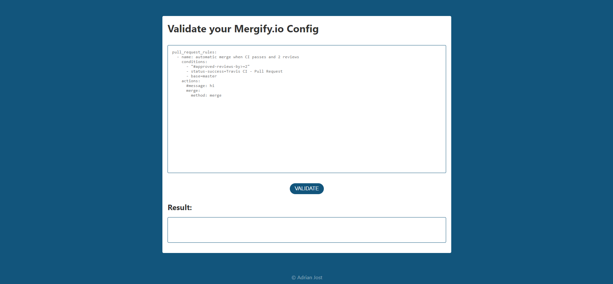

# Mergify.io config validator 

[](https://mergify.adrianjost.dev/)
[](https://app.codacy.com/app/adrianjost/mergify-verify?utm_source=github.com&utm_medium=referral&utm_content=adrianjost/mergify-verify&utm_campaign=Badge_Grade_Dashboard)
[](https://gitential.com/accounts/1294/projects/1711/share?uuid=7ef433a1-51c4-4570-9ef9-7bc393e5d3e3&utm_source=shield&utm_medium=shield&utm_campaign=1711)
[](https://gitential.com/accounts/1294/projects/1711/share?uuid=7ef433a1-51c4-4570-9ef9-7bc393e5d3e3&utm_source=shield&utm_medium=shield&utm_campaign=1711)

## About

Mergify is an aweseome GitHub-Bot! But checking your config can be a pain, when using Windows.
This Projects abstracts away the curl command from the [official documentation](https://doc.mergify.io/configuration.html#validation) and replaces it with a simple, intuitive Website.

[](https://mergify.adrianjost.dev)

## Development

```bash
# install dependencies
yarn install

# open with live server (http://localhost:8080)
yarn dev

# build for production
yarn build
```
